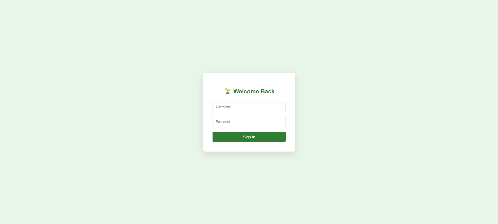
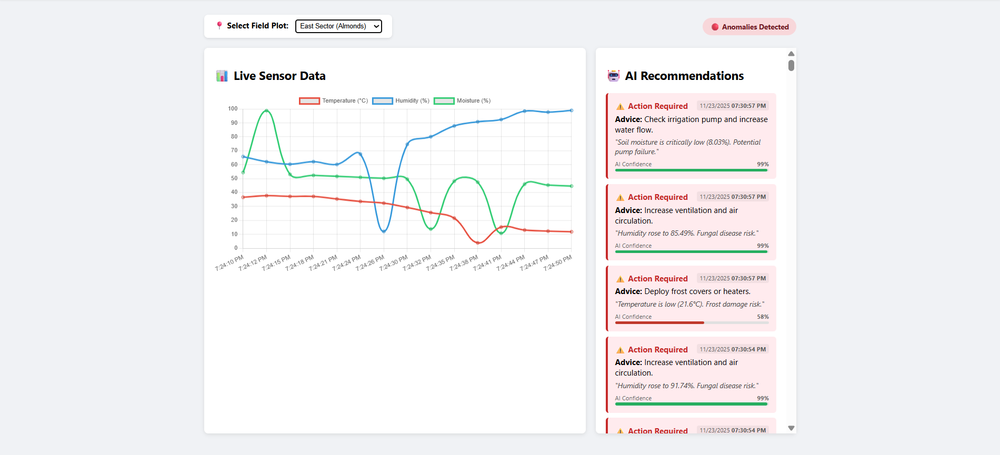
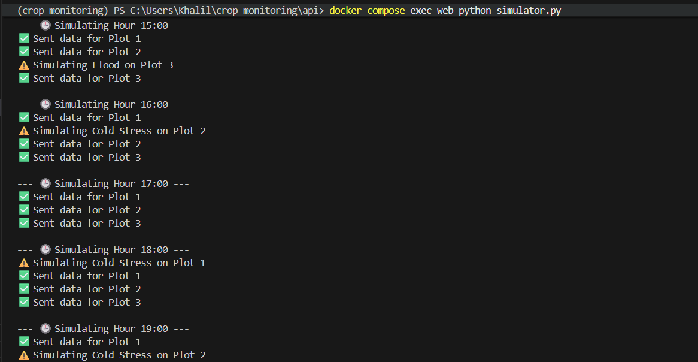

# 🌱 AI-Enhanced Crop Monitoring System

## Project Overview
This project is an end-to-end agricultural monitoring platform designed to ingest simulated IoT sensor data, detect environmental anomalies using Machine Learning (Isolation Forest), and provide actionable recommendations via an AI Agent.

Credit to [Mr.ChaoukiBayoudhi](https://github.com/ChaoukiBayoudhi) for the project idea.

**Key Features:**
* **Real-time Simulation:** Generates multi-plot sensor data (Temperature, Humidity, Moisture) with diurnal cycles.
* **Anomaly Detection:** Hybrid AI model (Isolation Forest + Thresholds) to detect Heat Stress, Frost, Drought, and Equipment Failure.
* **AI Agent:** Rule-based engine that translates anomalies into specific advice for farmers.
* **Dashboard:** Live visualization of crop health and real-time alerts.

---

## 🏗️ System Architecture

The system follows a Service-Oriented Architecture (SOA):

1.  **Simulator (Python):** Generates sensor readings and injects random anomalies (20% chance). Pushes data via HTTP POST.
2.  **Backend (Django REST Framework):** Validates data, handles JWT authentication, and orchestrates the logic.
3.  **ML Module:** Analyzes every incoming reading. Calculates an anomaly score and confidence level.
4.  **AI Agent:** Listens for "Anomaly Events" (via Signals), determines the root cause, and generates a recommendation.
5.  **Frontend (Django Templates):** Visualizes live data using Chart.js and polls for agent recommendations.

---

## 📸 Screenshots & Walkthrough

### 1. Secure Login Interface

*The system is secured with JWT Authentication. Users must log in to access farm data, ensuring data privacy between different farm owners.*

### 2. Farmer's Dashboard (Live Monitoring)

*The core interface for farmers. The left panel visualizes real-time temperature, humidity, and moisture trends. The right panel displays **Actionable AI Recommendations** (Red Cards) triggered by detected anomalies. Notice the "Plot Selector" at the top, allowing multi-farm management.*

### 3. Simulation & Multi-Plot Detection

*The Python Simulator running in real-time inside Docker. It generates distinct environmental patterns for multiple plots (Plot 1, 2, 3) simultaneously. You can see successful data transmission (Green Checks) and injected anomalies like "Flood" and "Cold Stress" (Yellow Warnings).*

### 4. Anomaly Detection Pipeline (Backend Logs)

*A view "under the hood" showing the backend processing chain: The ML Model detects an anomaly (e.g., Abnormal Humidity), calculates a confidence score (99%), and triggers the AI Agent via Django Signals to save a recommendation.*

---

## 🚀 Setup & Installation

### Prerequisites
* Docker Desktop (v4.52.0 or later)

### How to Run (Docker)
The entire system (Web, Database, ML) is containerized.

1.  **Build and Start the System:**
    ```bash
    docker-compose up --build
    ```
    *Wait until you see "Starting development server at http://localhost:8000/"*

2.  **Access the Dashboard:**
    * Open Browser: `http://localhost:8000/api/dashboard/`
    * **Username:** `admin`
    * **Password:** `admin`

3.  **Start the Sensor Simulation:**
    Open a new terminal and run the simulator inside the container:
    ```bash
    docker-compose exec web python simulator.py
    ```
    *You will see logs confirming data is being sent for Plots [1, 2, 3...]*

---

## 📊 Evaluation Metrics

The ML Model was evaluated using a synthetic test harness (`evaluate.py`) with 1,000 samples.

**Results:**
* **Recall (Sensitivity):** `1.00` (Detected 100% of true anomalies)
* **Precision:** `0.63`
* **F1-Score:** `0.77`
* **Accuracy:** `91.50%`

*To re-run the evaluation:*
```bash
docker-compose exec web python evaluate.py
```
## 🔌 API Documentation

**POST** | /token/ | Obtain JWT Access Token (Login)
**POST** | /sensor-readings/ | Ingest new sensor data (Triggers ML)
**GET** | /sensor-readings/?plot=1 | Get history for a specific plot
**GET** | /anomalies/ | List all detected anomalies
**GET** | /recommendations/?plot=1 | Get AI advice for a specific plot
**GET** | /plots/ | List all active field plots
